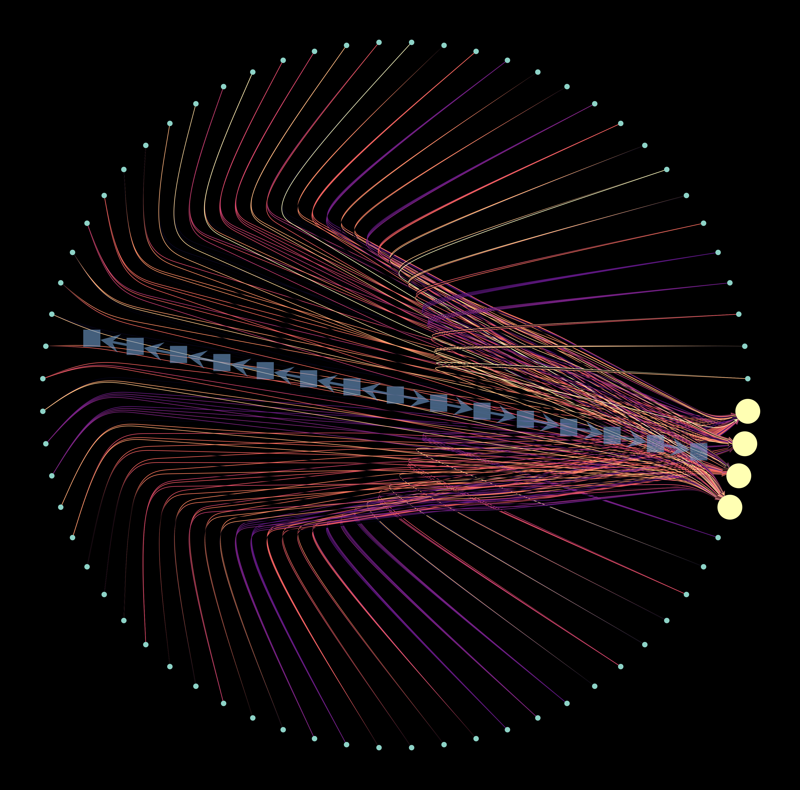
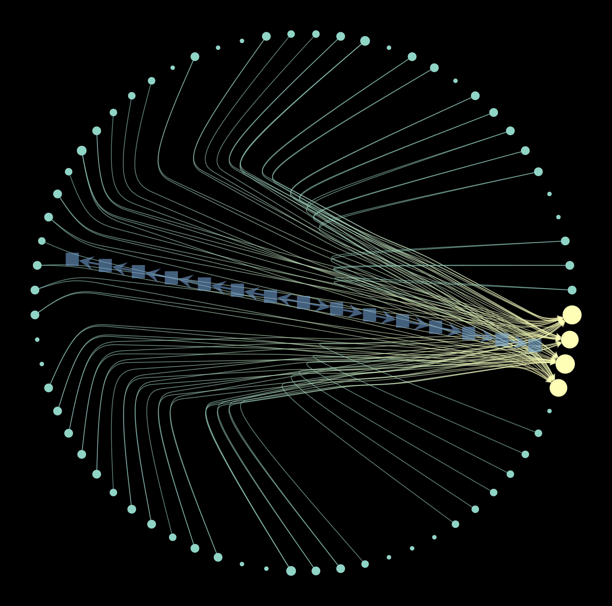

# AANN

## Overview
The Analog Artificial Neural Network (AANN) project involves creating a simple neural network for classifying a small set of images. Once trained, the model is converted into a graph representation, which is then used to construct a physical device that visually represents the neural network's structure.

## Continuous Neural Network Graph

This graph illustrates the continuous representation of the neural network.

## Discretized Neural Network Graph
This graph shows the discretized version of the neural network.

## Installation
The AANN device in operation.

