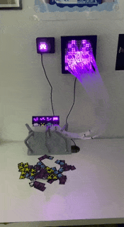

# AANN

## Overview
Analog Artificial Neural Network (AANN) is a project that creates a simple neural network for classifying a small set of images. The trained model is converted into a graph representation, which is then used to build a physical device that visually represents the network's structure.

