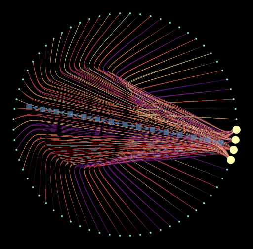

# AANN

## Overview
The Analog Artificial Neural Network (AANN) project involves creating a simple neural network for classifying a small set of images. Once trained, the model is converted into a graph representation, which is then used to construct a physical device that visually represents the neural network's structure.

### Continuous graph representation of the neural network

### Discretized graph representation of the neural network

### The AANN device in operation

